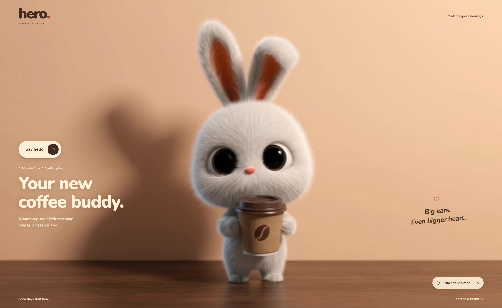

# Hero Café

**Your new coffee buddy.** An interactive café hero built with vanilla JavaScript, a complete video sprite sheet, and motion interpolation. Move around the scene and the rabbit follows your attention; leave it alone and it eases back to a recorded neutral pose.



## Features

- **All 240 source frames** in one canonical horizontal sprite, served through smaller lossless strips for browser compatibility.
- **Smooth in-between motion** using WebGL2 and precomputed bidirectional optical flow.
- **Cursor tracking** calibrated against the poses actually present in the clip.
- **Touch interaction** with scene-relative tracking, brief tap responses, and normal vertical scrolling.
- **Follow, Explore, and replay** modes, with a keyboard-accessible frame slider.
- **A responsive café layout** with self-hosted Nunito fonts and a liquid-fill button.
- **Reduced-motion support**, a static loading poster, and a Canvas 2D rendering fallback.
- **No frontend framework, bundler, API key, or runtime package installation.**

## Run locally

The generated assets are committed, so rebuilding the animation is optional. With Git and Python 3 installed:

```sh
git clone https://github.com/aliihsaad/Hero-Cafe.git
cd Hero-Cafe
python -m http.server 5183 --bind 127.0.0.1
```

Open **[http://127.0.0.1:5183](http://127.0.0.1:5183)**. Use `python3` instead of `python` if that is your system's Python command.

Serve the page over HTTP: opening `index.html` directly with `file://` will prevent the sequence manifest from loading in typical browser configurations. The included `devserver.py` is an alternative development server with no-cache headers.

## Deploy on Vercel

Import this GitHub repository into Vercel. The committed `vercel.json` selects **Other** as the framework, skips installation/build commands, and serves the repository root. No environment variables, Python runtime, or FFmpeg execution are needed on the host; the animation assets are already built.

`.vercelignore` limits deployment uploads to the website and required animation/font assets. The source video, documentation, pipeline, and local intermediate files remain outside the deployment. When the Vercel project is connected to GitHub, pushes to its production branch deploy automatically.

For the CLI, link the project to your own Vercel account/team before deploying:

```sh
vercel link
vercel --prod
```

See [Vercel's static-site build settings](https://vercel.com/docs/builds/configure-a-build) for the equivalent dashboard configuration.

## Try the interaction

| Action | Result |
| --- | --- |
| Move the mouse through the lower 75% of the desktop hero | The character follows using calibrated source poses. |
| Move into the desktop top quarter or leave the hero | The character eases to the nearest recorded neutral pose. |
| Tap the character scene on mobile | A short response, then an eased return to neutral. |
| Drag horizontally on the scene | Touch tracking follows the drag; release returns to neutral. |
| Swipe vertically | The page scrolls normally and tracking cancels. |
| Open the small animation-controls pill | Reveal Follow / Explore, the slider, replay, and Face forward. |
| Choose Explore | Horizontal position scrubs the full source sequence. |
| Use the slider | Select a frame; touch release preserves the selection. Home / End reach its endpoints. |
| Select Say hello or Play hello | Play the full clip at its original 24 fps with interpolated display frames. |

At widths of **760px and below**, only the separate character scene responds. Desktop's upper reset zone and side mapping do not apply to this stacked layout. With reduced motion enabled, automatic tracking is paused; explicit slider selection and requested replay remain available.

## How it works

```text
Source video → FFmpeg frame extraction → one horizontal sprite sheet
                         ↓
           optical-flow analysis + lossless runtime strips
                         ↓
Pointer / touch → calibrated pose → motion-distance spring
                         ↓
              adjacent-frame WebGL2 interpolation
```

1. **Extract every frame.** FFmpeg decodes the entire clip and tiles 800 × 450 versions of all 240 complete frames, in order. No frames are selected out, mirrored, or rearranged.
2. **Calibrate the gaze.** `pipeline/gaze-225025.json` records observed head directions and neutral passes. A generated video's requested choreography is not assumed to match its actual frames.
3. **Measure motion offline.** OpenCV estimates forward/backward flow between each adjacent pair and builds a cumulative measure of visual travel.
4. **Ease toward the target.** A time-based, critically damped spring operates in visual-motion distance, helping prevent fast turns and long holds from scrubbing at uneven apparent speeds.
5. **Load bounded strips.** The browser fetches ten-frame strips and keeps at most four decoded pages. Nearby pages are prefetched; older `ImageBitmap`s are explicitly closed. A slow page pauses the animation clock at the current pose instead of skipping ahead after the download.
6. **Render between frames.** The WebGL2 shader warps two adjacent source cells toward their intermediate positions before blending. Only small cells and their flow vectors are uploaded to the GPU. Integer frame positions retain the original source image.

The scene uses centered cover sizing. There is no animated camera transform; narrow screens crop the sides of the same composition. The runtime does not add a character rig or animate body parts independently.

## Project structure

```text
Hero-Cafe/
├── index.html                    # Hero markup and accessible controls
├── styles.css                    # Responsive layout, typography, liquid button
├── hero.js                       # Input mapping, playback, spring, lifecycle
├── frame-store.js                # Bounded loading and prefetch of runtime strips
├── motion-renderer.js            # WebGL2 interpolation and Canvas fallback
├── controls.js                   # Optional controls disclosure
├── devserver.py                  # Development server with no-cache headers
├── assets/
│   ├── character-sheet.png       # Every source frame, one horizontal sheet
│   ├── character-motion.png      # Packed optical-flow vectors
│   ├── runtime/                  # Browser-sized lossless frame/flow strips
│   ├── sequence.json             # Dimensions, gaze map, source identity, motion
│   ├── poster.webp               # Neutral loading/fallback image
│   └── fonts/                    # Nunito variable fonts and their license
├── pipeline/                     # Extraction, calibration, and flow generation
├── docs/                         # Preview and verification records
└── Character_looking_around_animation_1080p_20260919225025.mp4
```

Extracted frames, local backups, logs, and unused experiments are excluded from Git.

## Rebuild the animation

Rebuilding requires **Python 3.11+**, **FFmpeg and FFprobe on PATH**, and the Python packages in `pipeline/requirements.txt`. It is not required to run the site.

```sh
python -m pip install -r pipeline/requirements.txt
python pipeline/build_sequence.py "Character_looking_around_animation_1080p_20260919225025.mp4"
python pipeline/build_motion.py
python pipeline/build_runtime.py
```

The source is **1920 × 1080, 10 seconds, 24 fps**. Extraction writes full-resolution PNGs into a source-hash-specific `build/` folder before creating the runtime assets. Allow disk space for these intermediate frames.

For another video, create a matching calibration file and pass `--calibration path/to/calibration.json`. The builder checks the source filename and decoded frame count. See [the pipeline guide](pipeline/README.md) for the calibration format and build outputs.

## Customize

| Setting | Location | Purpose |
| --- | --- | --- |
| Copy, labels, and actions | `index.html` | Café branding and content. |
| Colors, type, spacing, mobile layout | `styles.css` | Presentation without changing animation logic. |
| `FOLLOW_START = .25` | `hero.js` | Desktop upper reset zone. |
| `SIDE_LOOK_ROW = .68` | `hero.js` | Desktop side calibration that avoids distant timeline switches near mid-height. |
| The 650ms touch-return delay | `hero.js` | How long a quick scene tap remains active. |
| Spring and visual-motion speed limits | `integrate()` in `hero.js` | Response and return timing. |
| Gaze landmarks and neutral frames | `pipeline/gaze-225025.json` | Calibration for a particular source clip. |

Keep the CSS and JavaScript **760px breakpoint** in sync. New artwork needs new pose calibration; more easing alone cannot fix incorrect frame selection. After replacing assets on a cached host, update the relevant versioned script/manifest URLs as well.

## Performance and limits

The repository retains the complete horizontal sheet and motion atlas as canonical build artifacts:

| Asset | Dimensions | File size |
| --- | --- | --- |
| Character sheet | 192,000 × 450 | 38.4 MB |
| Motion-vector atlas | 48,000 × 224 | 9.5 MB |

Decoding the originals would require about **330 MiB for the sheet** plus **41 MiB for motion**, and the 192,000px width proved unreliable in a user's browser. The production loader therefore never downloads either giant image. `pipeline/build_runtime.py` uses FFmpeg to split them losslessly and verifies every pixel against the originals.

The runtime assets contain 24 ten-frame pages, each with an 8,000 × 450 frame strip and a 2,000 × 224 vector strip. All pages together total about **49.8 MB**, but startup only needs the neutral page and then prefetches neighbors. The four-page cache retains at most approximately **62 MiB of decoded strips**, plus browser, rendering, and network overhead. Original resolution, frame order, gaze mapping, and optical-flow values are unchanged.

The source is a prerecorded path through poses, not a freely rotatable 3D character. Some direction changes can still traverse intermediate looks, and optical flow can produce artifacts where details become occluded. The first and last source frames are close, but not identical, so replay stops at the ending instead of wrapping across a visible seam.

Settled and offscreen scenes stop requesting animation frames. If WebGL2 is unavailable, Canvas 2D blends the source frames; missing optional vector strips use zero displacement. If the initial frame strip fails to load, the neutral poster remains visible.

## Verification

Development checks covered complete 240-frame replay, source-to-sprite pixel comparisons, cursor tracking, neutral returns, keyboard scrubbing, reduced motion, asset fallbacks, and mobile touch gestures. The mobile regression check used Chromium touch emulation at 390 × 844, plus a 320px layout check; it is not a physical iOS/Android compatibility claim.

See [verification notes and recorded results](docs/verification.md). Open `/?debug` locally to inspect `window.__hero`, including the current/target frame, frame coverage, renderer, timing samples, and source identity.

## Credits and licensing

Created by **[Ali Saad](https://github.com/aliihsaad)**. The character animation is supplied generated artwork; its original clip is included with the project.

Nunito is bundled with its [SIL Open Font License](assets/fonts/Nunito-LICENSE.txt). No project-wide license has been selected for the application code or character artwork.
